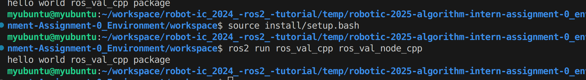
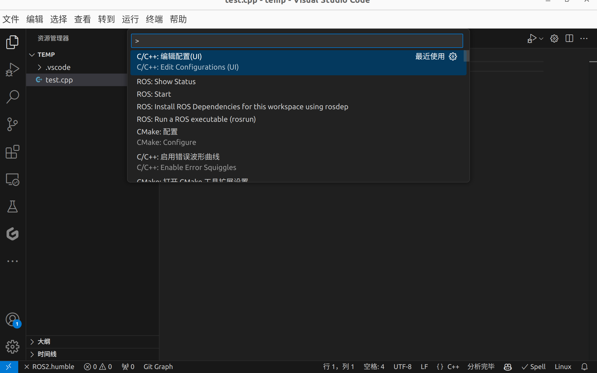
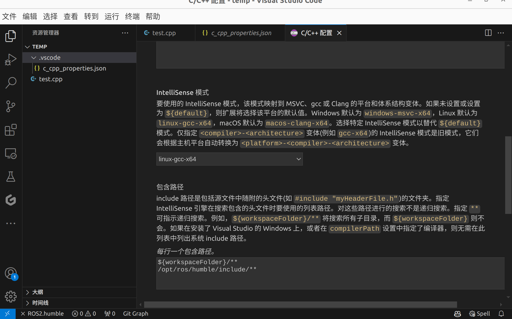
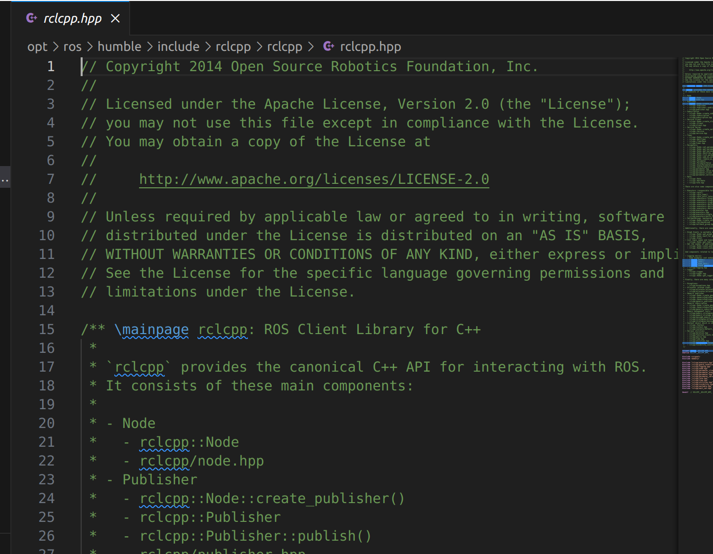
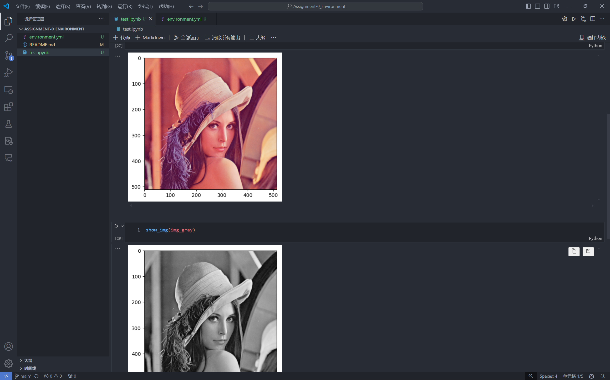

[](https://classroom.github.com/a/6CsfUSk7)
# Assignment-0 Environment
> [!TIP]
> 作业提交截止日期：2024 年 10 月 12 日 23:59

为了后续培训课程的顺利进行，你们需要在课前安装好相关的开发环境，本次作业旨在帮助你们安装和熟悉相关的工具。本教程仅作为引导，并不包含过多操作细节，遇到详细问题请自行查找资料进行学习，这是一个开发者的基本素养之一。本文档中的内容并不是唯一操作方式，可以按照你自己的喜好进行配置，不必完全按照本文档的步骤进行，只需要保证你可以正常完成后续的作业即可。在下文中，若遇到不熟悉的名词术语，请善用**搜索引擎**或**大模型**等方式进行学习。

## 0 课程安排

本赛季算法组培训一共分为 5 次课程，包含传统视觉、深度学习、ROS2三个部分，具体时间以及地点安排请关注算法组实习生群群公告。

在本次作业中，我们将主要安装传统视觉课程的环境，后续的深度学习和 ROS2 的环境安装将在后续的作业中进行。本次作业提交截止时间为 **2024 年 10 月 12 日 23:59**，逾期提交的作业将不再接受。

## 1 Git 以及 Github 基本使用

在实际开发中，我们经常会使用到 Git 进行代码的版本管理，而 Github 是一个基于 Git 的代码托管平台，我们可以在上面创建仓库，上传代码，查看他人的代码等，方便我们进行协作开发。在课前，你们需要安装 Git 并注册一个 Github 账号，学习 Git 的基本使用方法。

Git 教程可参考：
1. [【GeekHour】一小时Git教程](https://www.bilibili.com/video/BV1HM41137)
2. [【廖雪峰】Git教程](https://www.liaoxuefeng.com/wiki/896043488029600)

Git 仅需学习仓库的基本操作，如克隆仓库、提交代码、解决冲突等，其余高级操作可后续学习。

除此之外，你需要注册一个 Github 账号，并学习 Github 的基本使用方法，我们后续的课程任务发布以及代码提交都会通过 Github 进行。

## 2 Python 环境

可以使用 Anaconda/Miniconda/MinniForge 等工具进行 Python 环境的管理，大家可以选择自己喜欢的方式进行安装。个人建议使用 Miniforge 或 Miniconda 进行环境管理，因为这两个工具相对于 Anaconda 来说更加轻量级，且不会预装一些不需要的包。

安装后，请学习 conda 和 pip 的基本使用方法，例如：
1. 使用 conda 创建指定版本的虚拟环境，激活虚拟环境，安装和卸载包等。
2. 使用 pip 安装和卸载包，利用 requirements.txt 文件批量安装依赖包等。

### 2.1 传统视觉课程环境

在本次传统视觉的课程中，我们将主要使用 OpenCV 来进行图像处理，并且以 Python 为主要编程语言。OpenCV 是一个开源的计算机视觉库，它提供了很多图像处理和计算机视觉的函数，可以帮助我们快速实现一些功能。OpenCV 也有 C++ 版本，在实际开发中，C++ 版本也更常用且效率更高，但为了降低大家的学习难度，我们选择从 Python 进行入手。

为了教学方便，我们将统一环境，需要大家通过自己在上面已经安装了的环境管理工具安装好下述的环境。

```bash
conda create -n CV python=3.11
conda activate CV
conda install black ipykernel matplotlib mypy numpy
python -m pip install opencv-python
```

如果你有兴趣，也可以学习使用 yml 文件来安装环境，这样可以更方便地安装。文件已经在本目录下提供，名为 `environment.yml`。

    

## 3 代码编辑工具

在实际开发中，我们需要一个代码编辑工具来编写代码，这里推荐使用 Visual Studio Code，它是一个轻量级的编辑器，支持很多编程语言，有很多插件可以使用，可以帮助我们提高开发效率。当然，你也可以使用其他的编辑器，如 PyCharm、Sublime Text 等。在本次课程中，我们将以 Visual Studio Code 为主要的代码编辑工具。

Visual Studio Code 下载地址： [Visual Studio Code 官网](https://code.visualstudio.com/)

Visual Studio Code 配置 Python 开发环境：[Python 开发环境配置](https://code.visualstudio.com/docs/python/python-tutorial)

Visual Studio Code 使用 Jupyter Notebook：[Jupyter Notebook](https://code.visualstudio.com/docs/python/jupyter-support)

当你准备完成后请运行目录查下提供的测试代码文件 `test.ipynb` ，确保你的环境配置正确。
## 4 ROS环境搭建
### 4.1 前提条件
1. 已经使用鱼香ROS一键安装工具`wget http://fishros.com/install -O fishros && . fishros
`安装ROS2 Humble
2. VScodeC++、Python插件安装完成

### 4.2 ROS基础功能验证
1. 在workspace/src下，运行命令`ros2 pkg create ros_val_cpp --node-name ros_val_node_cpp --build-type ament_cmake --dependencies rclcpp`，新建功能包
2. 回到workspace，运行`colcon build --packages-select ros_val_cpp`
3. 执行命令：
```bash
source install/setup.bash
ros2 run ros_val_cpp ros_val_node_cpp
```
若出现`hello world ros_val_cpp package`则基础功能验证通过

### 4.3 VScode代码自动补全验证

1. 用code打开workspace:`code <your_path_to_workspace>`
2. 按下ctrl-shift-p，找到c++ configuration （UI）

3. 配置**编译器路径**（右侧小箭头下拉选择）、**包含路径**（添加一行`/opt/ros/humble/include/**`）

通过上面的方法在workspace下生成一个.vscode文件夹
`#include "rclcpp/rclcpp.hpp"`


若不发生红色报错，且**ctrl +点击该代码可以跳转**，测试通过
## 5 作业提交

本次培训的作业收发以及管理，我们将使用 Github Classroom 进行，你需要在 Github Classroom 上接受作业任务，并将代码以及文件提交到指定的仓库中。在接受作业任务后，你会收到一个包含仓库地址的邮件，你需要将本次作业的代码及文件提交到这个仓库中。相关操作仅需学习基本的 Git 操作即可，与本文开头的 Git 教程相似。

Github Classroom 使用教程：
1. [南京大学C-PL-2021 GitHub Classroom 介绍](https://www.bilibili.com/video/BV12L41147r7)
2. [Github Classroom 官方文档](https://docs.github.com/cn/education/manage-coursework-with-github-classroom)


在完成上述的安装和配置后，你需要将示例代码 `test.ipynb` 在VS Code 中的运行结果界面截图。例如：

### 作业提交内容
使用 Markdown 或 Word 等工具，（强烈推荐使用 Markdown，因为它更加简洁，且可以直接在 Github 上查看，是开发者的基本技能之一），编写一份文档，以`<年级>-<专业>-<姓名>` 命名，例如 `22-人工智能-张三`，将其提交到仓库中，包含以下内容：
1. 你的年级、专业、姓名等基本信息。
2. `test.ipynb`运行结果界面截图
3. `ROS基础功能验证`运行ros2 run界面完整截图
4. 跳转至`rclcpp/rclcpp.hpp`界面完整截图
5. （可选）你对本次作业的一些建议以及在过程中遇到的困难。

## 6 致谢

非常感谢2021级人工智能专业方笛学长提供的基础环境配置文档以及课程讲义，本文档在其基础上进行了修改和补充，为后续的培训课程提供了非常大的帮助。
